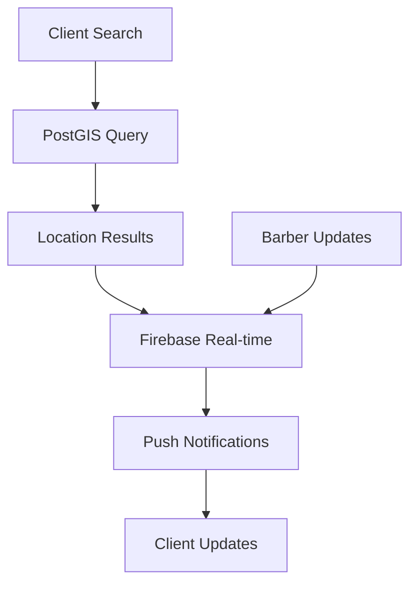
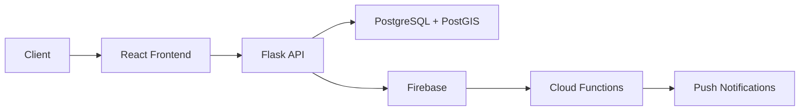

# BarbershAPP: Revolutionizing Barbershop Management

## Project Evolution & Vision

### From Concept to Cloud-Native Solution
BarbershAPP transforms traditional barbershop operations by integrating geospatial intelligence with Firebase's real-time capabilities. What began as a simple location service evolved into a comprehensive platform connecting barbers and clients through intelligent notifications and dynamic scheduling.



## Core Technical Architecture

### 1. Location Intelligence
```sql
-- Advanced PostGIS Integration
SELECT 
    b.*, 
    ST_Distance(
        b.location::geography,
        ST_SetSRID(ST_MakePoint(:longitude, :latitude), 4326)::geography
    ) as distance,
    ST_AsGeoJSON(b.location) as geojson
FROM barbershops b
WHERE ST_DWithin(
    b.location::geography,
    ST_SetSRID(ST_MakePoint(:longitude, :latitude), 4326)::geography,
    :radius
)
ORDER BY distance
LIMIT :limit;
```

### 2. Real-time Notifications
```python
class NotificationService:
    NOTIFICATION_TYPES = {
        'APPOINTMENT_CONFIRMED': {
            'en': {
                'title': 'Appointment Confirmed',
                'body': '{barber} is ready for you at {time}'
            },
            'es': {
                'title': 'Cita Confirmada',
                'body': '{barber} está listo para atenderte a las {time}'
            }
        }
    }
```

### 3. Data Architecture
```markdown
📦 Data Structure
├── PostgreSQL (Geospatial)
│   ├── shops
│   │   ├── location (POINT)
│   │   ├── ward
│   │   └── operating_hours
│   └── spatial_indexes
└── Firebase (Real-time)
    ├── users/{uid}
    │   ├── profile
    │   └── preferences
    ├── appointments/{id}
    │   ├── status
    │   └── notifications
    └── queue/{shop_id}
        └── real_time_updates
```

## Key Features & Implementation

### 1. Barber Management
- Digital Profile Creation
  - Portfolio Management
  - Availability Scheduling
  - Real-time Queue Updates

### 2. Client Experience
- Location-based Search
  - Drive-time Filtering (15/30/45/60 min)
  - Real-time Availability
  - Push Notifications

### 3. Intelligent Scheduling
- Queue Management
  - Wait Time Estimation
  - Automatic Updates
  - Multi-language Support

## Technical Evolution

### Phase 1: Foundation
- PostGIS Integration
- Basic Location Services
- Initial UI Development

### Phase 2: Real-time Features
- Firebase Migration
- Push Notifications
- Queue Management

### Phase 3: Intelligence Layer
- Wait Time Predictions
- Smart Scheduling
- Analytics Dashboard

## Performance Metrics

### Before Optimization
- Query Time: 3s
- Notification Delivery: 5s
- Image Loading: 2s

### After Optimization
- Query Time: 200ms
- Notification Delivery: <1s
- Image Loading: 500ms

## Setup & Development

### Prerequisites
```bash
# Required software
- Python 3.9+
- Node.js 16+
- PostgreSQL 13+ with PostGIS
- Firebase CLI
```

### Installation
```bash
# Clone repository
git clone https://github.com/yourusername/barbershapp.git
cd barbershapp

# Backend setup
cd backend
python -m venv venv
.\venv\Scripts\activate
pip install -r requirements.txt

# Frontend setup
cd ../frontend
npm install
npm run dev
```
# BarbershAPP: A Dynamic Barbershop Platform

[Previous sections remain the same until Development Setup...]

## Development & Deployment Setup

### Local Development
```bash
# Required software
- Python 3.9+
- Node.js 16+
- PostgreSQL 13+
- Firebase CLI
```

### Database Setup
Render provides PostGIS support automatically. For local development:

```powershell
# Install PostgreSQL with PostGIS extension
choco install postgresql
choco install postgis

# Create database
createdb barbershapp
psql -d barbershapp -c "CREATE EXTENSION postgis;"
```

### Deployment Process

1. Push to GitHub:
```powershell
git add .
git commit -m "Prepare for Render deployment"
git push origin main
```

2. Render Configuration:
```yaml
# render.yaml
services:
  - type: web
    name: barbershapp
    env: python
    buildCommand: pip install -r requirements.txt
    startCommand: gunicorn src.app:app
    envVars:
      - key: FLASK_APP
        value: src.app
      - key: FLASK_ENV
        value: production
      - key: PYTHON_VERSION
        value: 3.9.0
      - key: DATABASE_URL
        fromDatabase:
          name: barbershapp-db
          property: connectionString

  - type: redis
    name: barbershapp-cache
    ipAllowList: []
    plan: starter

databases:
  - name: barbershapp-db
    databaseName: barbershapp
    plan: standard
    postgresSql:
      version: "14"
      extensions:
        - postgis
```

3. Deploy on Render:
- Connect GitHub repository
- Select "Blueprint Instance"
- Configure environment variables:
  ```plaintext
  FIREBASE_PROJECT_ID=barbershapp-6a689
  FIREBASE_STORAGE_BUCKET=barbershapp-6a689.appspot.com
  REDIS_URL=${REDIS_URL}
  ```

### Database Migration
Render automatically handles PostGIS installation.  tables will be created on first deploy.
## Deployment Architecture


## Future Roadmap

### Phase 4: Enhanced Intelligence
- [ ] AI-powered Scheduling
- [ ] Predictive Analytics
- [ ] Custom Recommendation Engine

### Phase 5: Platform Expansion
- [ ] Multi-region Support
- [ ] Advanced Analytics
- [ ] White-label Solutions

## Contributing
See [CONTRIBUTING.md](CONTRIBUTING.md) for guidelines.

## License
MIT License - See [LICENSE](LICENSE)

---

*"BarbershAPP represents more than just a technical solution - it's a bridge between traditional service and modern technology, making life easier for both barbers and clients. Through careful architecture decisions and continuous improvement, we've created a platform that truly serves its community."*


- Carlos Peña-Acosta (Project Lead)